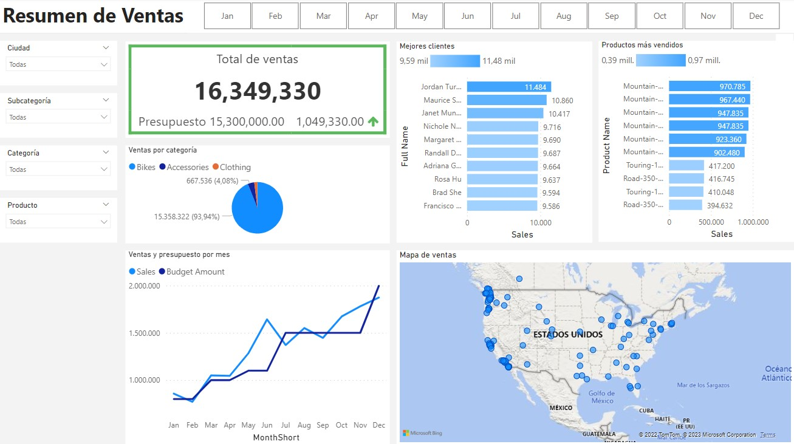

# Proyecto Tienda Deportiva

Este proyecto tiene como objetivo mejorar el análisis de ventas por internet mediante la creación de paneles visuales interactivos. Los paneles permitirán una mejor comprensión de los productos vendidos, los clientes a los que se les vendieron y la evolución de las ventas a lo largo del tiempo. Además, se podrán aplicar filtros para analizar ventas por productos y clientes específicos. Este proyecto mejorará la eficiencia del análisis de ventas y permitirá tomar decisiones informadas basadas en los datos de ventas.

